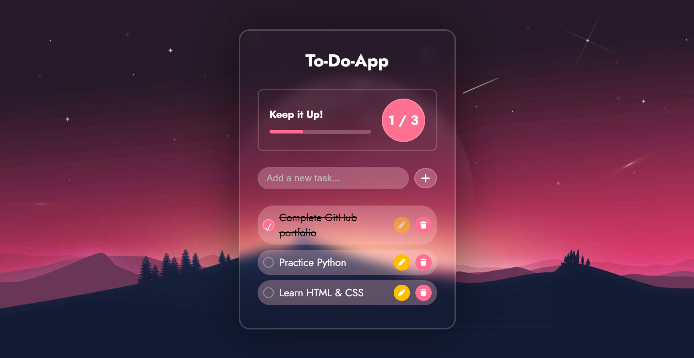

# 📝 To-Do List Web App

A responsive and interactive To-Do List web application built using HTML, CSS, and JavaScript.

## 📌 Overview

This project is a simple task management web application that allows users to create, edit, complete, and delete tasks.

The application also tracks task completion progress and stores tasks in the browser using Local Storage.

## 🖥️ Application Preview



## ✨ Features

- ➕ Add new tasks
- ✏️ Edit tasks
- 🗑️ Delete tasks
- ✅ Mark tasks as completed
- 📊 Track task completion progress
- 💾 Save tasks using Local Storage
- 🎉 Confetti animation when all tasks are completed
- ⌨️ Add tasks using the Enter key
- 📱 Responsive design for different screen sizes

## 🛠️ Technologies Used

- HTML5
- CSS3
- JavaScript
- Local Storage
- Font Awesome
- Google Fonts

## 📁 Project Structure

```text
to-do-app/
│
├── index.html
├── style.css
├── script.js
│
└── images/
    ├── background.jpg
    └── image1.svg

▶️ How to Run
1. Clone the repository
git clone https://github.com/prapti-patil/to-do-app.git
2. Open the project folder
cd to-do-app
3. Run the application

Open index.html in your web browser.
No server or installation is required.

💡 How It Works

Tasks are added to the task list through the input field.
The application updates the completion progress whenever a task is completed or deleted.
Tasks are stored in the browser's Local Storage, allowing them to remain available after refreshing the page.
The application also disables editing for completed tasks and displays a confetti animation when all tasks are completed.

📱 Responsive Design

The application includes responsive CSS rules so that the interface adjusts for smaller screens such as mobile devices.

🔮 Future Improvements

Add task categories
Add due dates and reminders
Add priority levels
Add dark/light theme switching
Add task filtering
Add cloud-based storage
Add user authentication

👩‍💻 Author

Prapti Patil
Computer Engineering Student | Aspiring Software Developer


